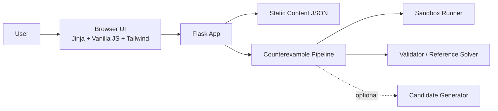
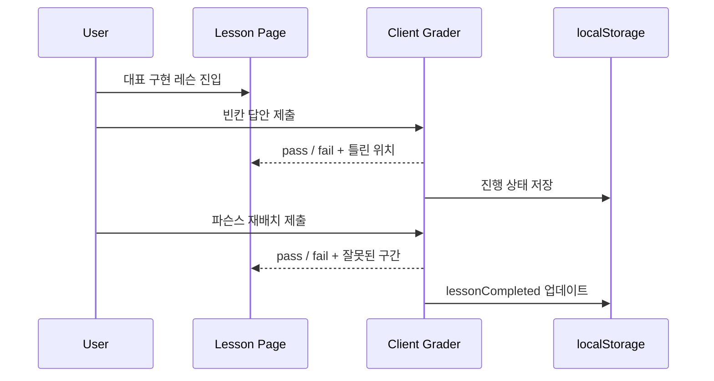
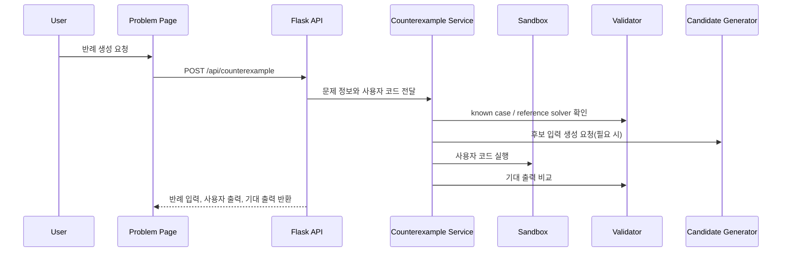

# 02. Architecture

## 1) 기술 선택과 이유

| 영역 | 선택 기술 | 선택 이유 | 대안 |
| --- | --- | --- | --- |
| Frontend | `HTML`, `CSS`, `JavaScript`, `Tailwind CSS`, `Jinja` | 프런트엔드 프레임워크 없이도 명세된 화면과 상호작용을 충분히 구현할 수 있고, Flask 템플릿과 자연스럽게 맞물린다 | React / Vue |
| Backend | `Python Flask` | 콘텐츠 로딩과 counterexample 파이프라인을 한 앱에서 단순하게 제공할 수 있다 | FastAPI |
| Storage | repo 내 JSON + 브라우저 `localStorage` | 콘텐츠는 버전 관리가 쉬워지고, 학습 진행 상태는 로그인 없이도 유지할 수 있다 | SQLite / PostgreSQL |
| Infra | 단일 Flask 배포 + 정적 자산 서빙 | 데모 우선 MVP에 맞는 가장 단순한 운영 모델이다 | 프런트/백 분리 배포 |

## 2) 시스템 구성



설명:

- 프론트 역할: 개념 화면, 대표 구현 레슨, `빈칸 -> 파슨스` 상호작용, 진행 상태 저장, 실전 문제 입력 UI를 담당한다
- 서버 역할: 정적 콘텐츠 로딩, 페이지 렌더링, 반례 파이프라인 실행을 담당한다
- 저장소 역할: 콘텐츠의 source of truth는 repo 내 JSON이며, 사용자 진행 상태의 source of truth는 브라우저 `localStorage`다
- 인증 / 세션 경계: 인증 없음, 서버는 요청 단위로만 상태를 처리한다
- 전략 메모: mock-first가 아니라 정적 데이터 + 실제 Flask API를 함께 쓰는 real-backend MVP다

## 3) 레이어 구조

- App / Route Layer: `app.py`가 페이지 라우트와 API 라우트를 등록한다
- UI Template Layer: `templates/`가 홈, 개념, 레슨, 실전 문제 화면을 렌더링한다
- Feature Layer: `static/js/`가 레슨 채점, 진행 상태, counterexample 요청 상호작용을 처리한다
- Data / Contract Layer: `content/` JSON과 로컬 저장 키, API request/response shape를 고정한다
- Server / Integration Layer: `services/`가 콘텐츠, deterministic validator, sandbox, counterexample 파이프라인을 담당한다

현재 프로젝트 구조:

```text
app.py
content/
  algorithms/
    <slug>/
      concept.json
      lesson.json
      problem.json
      visuals/
static/
  css/
    app.css
  js/
    concept.js
    lesson.js
    progress.js
    problem.js
    counterexample.js
templates/
  base.html
  index.html
  concept.html
  lesson.html
  problem.html
services/
  content_service.py
  grading_service.py
  counterexample_service.py
  sandbox_service.py
  validation_service.py
validators/
  <slug>/
    reference_solver.py
    known_cases.json
docs/
```

## 4) 주요 데이터 모델 또는 상태 계약

### Entity A. `AlgorithmMeta`

| 필드 | 타입 | 설명 | 필수 여부 |
| --- | --- | --- | --- |
| `slug` | `string` | 알고리즘 식별자 | Yes |
| `title` | `string` | 화면 표시 이름 | Yes |
| `aliases` | `string[]` | 검색용 별칭 | No |
| `difficulty` | `string` | 입문 난이도 구분 | Yes |
| `tags` | `string[]` | 탐색/분류 태그 | No |

### Entity B. `RepresentativeLesson`

| 필드 | 타입 | 설명 | 필수 여부 |
| --- | --- | --- | --- |
| `algorithmSlug` | `string` | 어떤 알고리즘 레슨인지 식별 | Yes |
| `codeLanguage` | `"python"` | 대표 구현 언어 | Yes |
| `representativeCode` | `string` | 기준 파이썬 구현 | Yes |
| `traceSteps` | `object[]` | 상태 변화 추적 정보 | Yes |
| `blankExercise` | `object` | 빈칸 단계 데이터 | Yes |
| `parsonsExercise` | `object` | 파슨스 단계 데이터 | Yes |
| `commonMistake` | `object` | 대표 오해와 설명 | Yes |

### Entity C. `UserProgress`

| 필드 | 타입 | 설명 | 필수 여부 |
| --- | --- | --- | --- |
| `algorithmSlug` | `string` | 현재 학습 중인 알고리즘 | Yes |
| `currentStage` | `"blank" \| "parsons" \| "problem"` | 현재 위치 | Yes |
| `passedStages` | `string[]` | 통과한 단계 목록 | Yes |
| `attempts` | `{ blank: number, parsons: number }` | 단계별 시도 횟수 | Yes |
| `lessonCompleted` | `boolean` | 레슨 완료 여부 | Yes |

경계 메모:

- 알고리즘당 `lesson.json`은 정확히 1개만 둔다
- `whiteboardExercise` 같은 자유 구현 스키마는 MVP 데이터 모델에서 제외한다
- 레슨 합격 판정의 source of truth는 클라이언트 deterministic grader이며, 서버는 그 결과를 덮어쓰지 않는다
- foundation 브랜치의 `/api/counterexample`은 경로와 입력 검증만 고정하고, 실제 탐색 로직은 후속 브랜치가 구현한다

## 5) 정합성 규칙

- 알고리즘당 대표 파이썬 구현은 1개만 허용한다
- 학습 단계는 항상 `blank -> parsons` 순서로만 진행된다
- 빈칸 채점은 normalize 후 문자열 비교와 허용 동의어 비교로만 처리한다
- 파슨스 채점은 `answerOrder`와 `groupedIndices`만으로 판단하며 LLM을 사용하지 않는다
- 반례 파이프라인은 known case, reference solver, brute force를 우선하고 후보 생성 보조는 선택 사항이다
- counterexample이 `found:false`여도 정답 보장으로 해석하지 않는다

## 6) 핵심 시퀀스

### Flow A. 레슨 단계 통과



### Flow B. 반례 생성



## 7) 운영 / 배포 메모

- 실행 환경: Python 3.11+ 기준
- 환경 변수: `FLASK_ENV`, 샌드박스 제한값 관련 변수, 필요 시 후보 생성 보조 키
- 배포 전략: 단일 Flask 앱을 preview 후 main 배포하는 단순 구조
- 로깅 / 모니터링: 요청/에러 로그 중심의 최소 운영, 정식 모니터링은 Post-MVP
